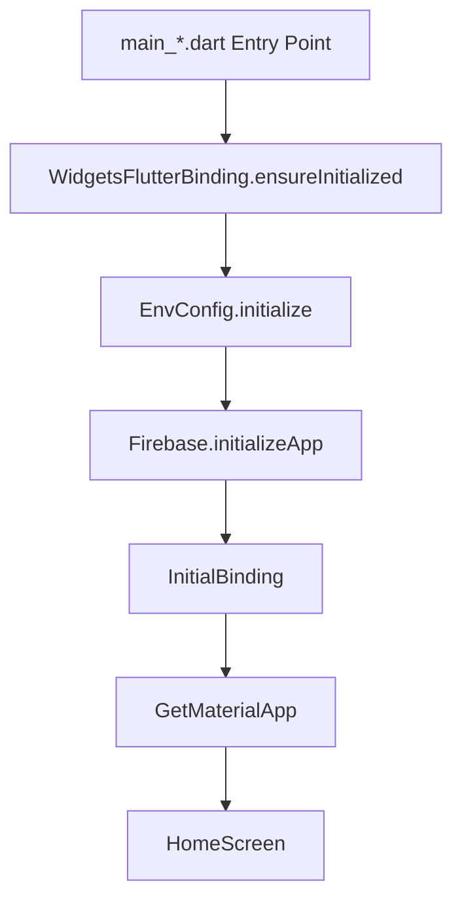

# 14 — Phase 1.2: Core Architecture Plan

> **Document Status:** ✅ Complete — Closed & Approved  
> **Last Updated:** 2026-05-30  
> **Checkpoint:** 1.2 of 6 — Core Architecture  
> **Owner:** Engineering Team  
> **Prerequisite:** Phase 1.1 🔒 CLOSED & APPROVED  
> **Next Checkpoint:** 1.3 — Theme & Design System  

---

## Goal

Define and implement the core architectural framework of MemoVault, combining Clean Architecture principles with GetX state management, routing, and dependency injection.

This checkpoint establishes the coding patterns, folder structures, error handling conventions, environment abstractions, and contracts that all future features (Notes, Vault, Messaging) will build upon.

---

## Folder Structure

We enforce a strict Clean Architecture folder layout to separate concerns and ensure testability and scalability.

```
lib/
├── core/                                 # Shared cross-cutting framework files
│   ├── bindings/                         # Global and initial bindings
│   ├── config/                           # Flavor configurations and environment variables
│   ├── constants/                        # Global asset keys, UI spacing, key sizes
│   ├── errors/                           # App-specific failures and exceptions
│   ├── extensions/                       # Utility extension methods on types
│   ├── routes/                           # App pages and route constants
│   ├── services/                         # Global, long-lived GetX services (e.g., storage)
│   ├── utils/                            # Generic helper utilities (crypto, date parsers)
│   └── widgets/                          # Shared, domain-agnostic UI widgets
│
├── data/                                 # Data layer (retrieval, caching, serialization)
│   ├── datasources/                      # Local (Isar) and remote (Firestore) APIs
│   ├── models/                           # Data transport models and JSON mapping
│   └── repositories/                     # Implementations of domain repository contracts
│
├── domain/                               # Pure business logic layer (no external dependencies)
│   ├── entities/                         # Pure business logic models (no annotations/decorators)
│   ├── repositories/                     # Interfaces/contracts defining operations
│   └── usecases/                         # Single-responsibility business actions
│
└── features/                             # Feature-specific folder (contains UI slices)
```

---

## Environment Abstraction

To support multi-flavor builds securely, environment configurations must be abstracted into a clean interface. All configuration is Firebase-centric, and no fictional REST API endpoints or server URLs are included.

### `lib/core/config/env_config.dart`
```dart
import 'package:flutter/foundation.dart';

enum Environment { dev, staging, prod }

abstract final class EnvConfig {
  static late final Environment environment;
  static late final String firebaseProjectId;
  static late final bool enableDetailedLogging;
  static late final bool enableAnalytics;

  static void initialize(Environment env) {
    environment = env;
    switch (env) {
      case Environment.dev:
        firebaseProjectId = 'memovault-dev';
        enableDetailedLogging = true;
        enableAnalytics = false;
      case Environment.staging:
        firebaseProjectId = 'memovault-staging';
        enableDetailedLogging = true;
        enableAnalytics = true;
      case Environment.prod:
        firebaseProjectId = 'memovault-prod';
        enableDetailedLogging = false;
        enableAnalytics = true;
    }
  }

  static bool get isProduction => environment == Environment.prod;
  static bool get isDevelopment => environment == Environment.dev;
}
```

- Loaded during bootstrap in each flavor entry point:
  - `main_dev.dart` calls `EnvConfig.initialize(Environment.dev)`
  - `main_staging.dart` calls `EnvConfig.initialize(Environment.staging)`
  - `main_prod.dart` calls `EnvConfig.initialize(Environment.prod)`

---

## App Bootstrap Lifecycle

The application startup sequence is documented below to ensure a predictable initialization path.



### Startup Sequence Details
1. **Entry Point (`main_*.dart`)**: The OS starts the flavor-specific Dart entry point file.
2. **Framework Binding**: `WidgetsFlutterBinding.ensureInitialized()` is called to bind the Dart VM to the Flutter engine.
3. **Environment Setup**: `EnvConfig.initialize(...)` is called with the flavor's configuration.
4. **Firebase Wiring**: `Firebase.initializeApp(...)` connects the app to the flavor-specific Firebase project.
5. **Initial DI Wiring**: `InitialBinding()` executes to register critical long-lived singletons (database services, secure storage).
6. **App Launch**: `GetMaterialApp()` starts running, loads routing, and opens the default `AppRoutes.home` view (`HomeScreen`).

---

## Dependency Injection (DI) Registration Strategy

To keep dependency injection consistent across features, we establish the following registration rules:

| Dependency Type | Lifecycle / Duration | Registration Method | Purpose / Scope |
|---|---|---|---|
| **Global Services** | App-wide (Never disposed) | `Get.put(..., permanent: true)` | Critical database, secure storage, and networking layers. |
| **Asynchronous Services** | App-wide (Never disposed) | `Get.putAsync(..., permanent: true)` | Services requiring async bootstrap (e.g. Isar setup). |
| **Controllers** | Feature-wide (Disposed on screen pop) | `Get.lazyPut<Controller>(...)` | UI state managers. Tied to route lifecycle. |
| **Repositories** | Feature-wide (Disposed on screen pop) | `Get.lazyPut<Repository>(...)` | Data retrieval wrappers. Instantiated only when needed. |
| **Use Cases** | Feature-wide (Disposed on screen pop) | `Get.lazyPut<UseCase>(...)` | Business logic executors. Instantiated on demand. |

- **No bindings will be created in Phase 1.2** for individual features, as there are no controllers/repositories implemented yet. The placeholder route will not have a binding.

### Dependency Initialization Binding (`InitialBinding`)
Runs during app initialization in `app.dart`.
```dart
import 'package:get/get.dart';
import 'package:memovault/core/services/network_service.dart';

class InitialBinding implements Bindings {
  @override
  void dependencies() {
    // Register global services as singletons.
    // Base services are registered lazily but instantiated on startup if required by routing.
    Get.lazyPut<NetworkService>(() => NetworkService(), fenix: true);
  }
}
```

---

## Route & Middleware Architecture

We use GetX named routing. In Phase 1.2, routes are mapped to views directly without feature bindings or controllers.

### `lib/core/routes/app_pages.dart`
```dart
import 'package:get/get.dart';
import 'package:memovault/core/routes/app_routes.dart';
import 'package:memovault/features/home/views/home_screen.dart';

abstract final class AppPages {
  static final List<GetPage<dynamic>> pages = [
    GetPage(
      name: AppRoutes.home,
      page: () => const HomeScreen(),
      // Bindings will be added here in future checkpoints when dependencies are introduced.
    ),
  ];
}
```

### Route Middleware Architecture
Route middleware allows us to intercept navigation for security checks (e.g., auth checks in Phase 4, panic mode redirects in Phase 3). 

No middleware classes are implemented in Phase 1.2. Future middleware will follow this design structure:

```dart
// Theoretical future middleware example:
// class PanicModeMiddleware extends GetMiddleware {
//   @override
//   RouteSettings? redirect(String? route) {
//     return isPanicModeActive ? const RouteSettings(name: AppRoutes.fakeHome) : null;
//   }
// }
```

---

## Error Handling & Result/Failure Pattern

Exceptions must not bubble up unhandled. We enforce a functional **Result/Failure** pattern for all operations in the Domain and Data layers.

### 1. Failures Definition (`lib/core/errors/failures.dart`)
We define a generic `Failure` base class. The Domain layer relies strictly on this base contract or infrastructure-agnostic descriptors.
```dart
abstract class Failure {
  final String message;
  const Failure(this.message);
}

// Data-specific failures used only in the Data layer implementations:
class DatabaseFailure extends Failure {
  const DatabaseFailure(super.message);
}

class NetworkFailure extends Failure {
  const NetworkFailure(super.message);
}

class SecurityFailure extends Failure {
  const SecurityFailure(super.message);
}
```

### 2. Result Wrapper (`lib/core/errors/result.dart`)
Instead of throwing raw exceptions, repositories return a `Result` wrapper carrying either success data or a generic `Failure`.

```dart
/// Represents the outcome of an operation.
sealed class Result<S, F extends Failure> {
  const Result();

  /// Executes [onSuccess] if result is successful, or [onFailure] if failed.
  T fold<T>(T Function(S success) onSuccess, T Function(F failure) onFailure);
}

class Success<S, F extends Failure> extends Result<S, F> {
  final S value;
  const Success(this.value);

  @override
  T fold<T>(T Function(S success) onSuccess, T Function(F failure) onFailure) {
    return onSuccess(value);
  }
}

class FailureResult<S, F extends Failure> extends Result<S, F> {
  final F failure;
  const FailureResult(this.failure);

  @override
  T fold<T>(T Function(S success) onSuccess, T Function(F failure) onFailure) {
    return onFailure(failure);
  }
}
```

---

## Base Clean Architecture Contracts

### 1. Base Repository Contract (Domain)
Repositories are declared as abstract contracts in the **Domain** layer. The domain signatures use the generic `Failure` class, maintaining decoupling from storage platforms:
```dart
// lib/domain/repositories/notes_repository.dart
import 'package:memovault/core/errors/failures.dart';
import 'package:memovault/core/errors/result.dart';

abstract interface class NotesRepository {
  Future<Result<List<String>, Failure>> fetchNotes();
}
```

### 2. Base Repository Implementation (Data)
Implementations live in the **Data** layer. They perform the concrete work, catch database/platform-specific exceptions, and map them back to domain-friendly failures:
```dart
// lib/data/repositories/notes_repository_impl.dart
import 'package:memovault/core/errors/failures.dart';
import 'package:memovault/core/errors/result.dart';
import 'package:memovault/domain/repositories/notes_repository.dart';

class NotesRepositoryImpl implements NotesRepository {
  @override
  Future<Result<List<String>, Failure>> fetchNotes() async {
    try {
      // Fetch from local datasource (e.g. Isar database)
      return const Success(['Note 1', 'Note 2']);
    } catch (e) {
      // Wrap local database exceptions cleanly for the domain layer
      return FailureResult(DatabaseFailure('Failed to load notes: $e'));
    }
  }
}
```

---

## Testing Strategy

To maintain production-grade reliability:

1. **Unit Tests (Domain)**:
   - Use cases must be unit tested.
   - Use cases must mock repositories using `mocktail`.
   - Verify business flow logic (no UI dependency).
2. **Unit Tests (Data)**:
   - Repositories must be tested by mocking data sources.
   - Verify proper exception wrapping into clean failures.
3. **Controller Tests (Features)**:
   - Feature controllers must be tested with simulated user operations.
   - Verify state progression (e.g., loading → success → idle).

---

## Verification Plan

### Automated Tests
- Create unit tests for:
  - `Result` functionality (verifying `fold` executes correct paths)
  - `EnvConfig` initialization (verifying flavor parameter outputs match expected Firebase configurations)
- Build check: `fvm flutter analyze` and `fvm flutter test`.

### Manual Verification
- Verify that navigating to a non-existent route falls back gracefully without breaking the widget tree.
