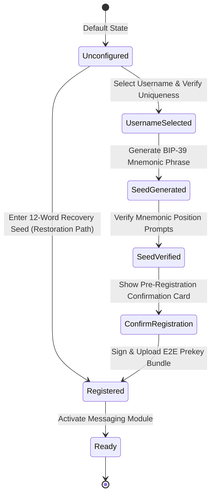

# Phase 4.2.1 — Messaging Identity Onboarding Flow

This document defines the onboarding state machine, secure storage schema, background E2E key services, and user interfaces required to establish a secure cryptographic pseudonym identity in MemoVault before E2EE messaging is activated.

---

## 1. Onboarding State Machine & Lifecycle

Until a secure messaging identity is fully generated and registered on the server, the active conversation lists, messaging streams, and connection menus remain locked behind the **Identity Onboarding Flow**.



### 1.1 Secure Storage Schema & Ephemeral Mnemonic Policy
To enforce the highest cryptographic standards, MemoVault mandates a **No Plaintext Mnemonic Persistence Policy**:

> [!CAUTION]
> The plaintext 12-word recovery mnemonic seed is **NEVER** persisted to local databases or secure storage. It exists exclusively inside volatile RAM memory (`RxString` or local variable) during the generation and verification stages. Once the master seed is derived and the E2E Identity Keys ($IK_{pub}$, $IK_{priv}$) are generated, the plaintext string is immediately wiped from memory.

The following persistent states are stored securely in SQLCipher-encrypted storage (`hidden_vault.db` or GetStorage secure key container):

| State Key | Type | Description |
| :--- | :--- | :--- |
| `messaging_setup_state` | `String` | Current onboarding state: `unconfigured`, `username_selected`, `seed_generated`, `seed_verified`, `registered`, `ready` |
| `messaging_my_username` | `String` | Registered active secure pseudonym (e.g. `@itesh`) |
| `messaging_identity_key_pub` | `String` | Public Identity Key ($IK_{pub}$) published to directory |
| `messaging_identity_key_priv`| `String` | Private Identity Key ($IK_{priv}$) kept locally on device |
| `messaging_device_registered` | `Bool` | Whether device token and prekeys are successfully uploaded |

### 1.2 Username Validation Rules & Reserved Words Policy
To prevent collision conflicts, spam, and spoofing, usernames must adhere to strict validation rules verified at the client and database constraints layer:

1.  **Length Constraints**: Must be between **3 and 20 characters** (excluding the `@` prefix).
2.  **Allowed Character Set**: Restricted to standard lowercase alphanumeric characters and underscores: `^[a-z0-9_]{3,20}$` (Regex).
3.  **Strict Normalization**: Any text entered by the user is instantly converted to lowercase (`.toLowerCase()`) and stripped of leading/trailing whitespaces before conducting uniqueness lookups.
4.  **Client-Side Reserved Words Filter**: The onboarding wizard instantly rejects attempts to register system, corporate, or moderator handles. The client blocks the following words before calling the directory:
    *   `admin`, `administrator`, `moderator`, `staff`, `support`, `system`, `root`, `official`, `memovault`, `security`.

---

## 2. Core Service Framework

To support this onboarding pipeline without leaking cryptographic material or blocking UI thread executions, we implement four dedicated, decoupled services:

```mermaid
graph TD
    A[MessagingSetupController] --> B[UsernameAvailabilityService]
    A --> C[SeedRecoveryService]
    A --> D[MessagingIdentityService]
    A --> E[PrekeyRegistrationService]
    
    B -->|Query Firestore| F[(/pseudonyms/{username})]
    C -->|BIP-39| G[Master Seed & IK Derivation]
    E -->|Publish| H[(/prekey_bundles/{username})]
```

### 2.1 UsernameAvailabilityService
*   **Responsibility**: Queries Firestore to check if a specific username is available.
*   **Interface**:
    ```dart
    abstract class UsernameAvailabilityService {
      /// Returns true if the username is available (i.e. document does not exist).
      Future<bool> checkAvailability(String username);
    }
    ```
*   **Security Principle**: To prevent username enumeration, checks are rate-limited. The lookup checks the exact path `/pseudonyms/{username}` rather than calling wildcards.

### 2.2 SeedRecoveryService
*   **Responsibility**: Generates standard BIP-39 seed phrases, derives cryptographic private/public keys, and validates restored seed phrases.
*   **Interface**:
    ```dart
    abstract class SeedRecoveryService {
      /// Generates a list of 12 words conforming to BIP-39 standard.
      List<String> generateMnemonic();
      
      /// Verifies if a given mnemonic string is a valid BIP-39 phrase.
      bool validateMnemonic(String mnemonic);
      
      /// Derives the Zero-Knowledge Identity Keypair from the mnemonic phrase.
      Future<KeyPair> deriveIdentityKey(String mnemonic);
    }
    ```

### 2.3 PrekeyRegistrationService
*   **Responsibility**: Compiles the identity key, signed prekey, signatures, and one-time prekeys into a bundle and uploads them to Firestore.
*   **Interface**:
    ```dart
    abstract class PrekeyRegistrationService {
      /// Encrypts and publishes the E2E prekey bundle to /prekey_bundles/{username}.
      Future<void> registerBundle({
        required String username,
        required KeyPair identityKey,
        required String signedPrekey,
        required String signature,
        required List<String> oneTimePrekeys,
      });
    }
    ```

### 2.4 MessagingIdentityService
*   **Responsibility**: Orchestrates the persistent states, handles local database boots, and manages identity revocations in "One Device Rule" overrides.
*   **Interface**:
    ```dart
    abstract class MessagingIdentityService {
      /// Returns the current onboarding state of secure messaging.
      Rx<MessagingSetupState> get setupState;
      
      /// Completes username selection and transitions state.
      Future<void> saveSelectedUsername(String username);
      
      /// Completes seed phrase generation and derivation.
      Future<void> completeIdentityRegistration(KeyPair identityKey);
      
      /// Revokes the current local identity (used for Panic PIN or identity reset).
      Future<void> revokeIdentity();
    }
    ```

---

## 3. UI Screens Specification

All screens are designed in conformity with MemoVault's premium design system—utilizing harmonized glassmorphism color palettes, modern typography, zero raw material shapes, and safe view insets.

### Screen 1 — MessagingSetupScreen (Unconfigured State)
*   **Aesthetic**: Large glassmorphic lock icon with dynamic glowing ambient light.
*   **Description**: Introduces the zero-knowledge nature of the messaging network.
*   **Actions**:
    *   `[ Setup Messaging ]` -> Navigates to Username Selection.
    *   `[ Restore Identity ]` -> Navigates to Seed Recovery Entry.

### Screen 2 — UsernameSelectionScreen
*   **Aesthetic**: Sleek interactive text field with real-time feedback icon and validation helper cards.
*   **Description**: Users type their private pseudonym (e.g. `@shadowfox`). Applies strict validation and filters system reserved words instantly.
*   **Actions**:
    *   Dynamic checking as the user types (with a 400ms debounce).
    *   Displays `Username available` in harmonized theme color, or `Username taken` if the Firestore check returns matching documents.
    *   `[ Continue ]` button is enabled *only* if the checked username is unique and verified.

### Screen 3 — RecoverySeedScreen
*   **Aesthetic**: HSL glassmorphic grid displaying 12 word blocks. Words are hidden behind a secure blur overlay by default to protect against physical over-the-shoulder lookups.
*   **Description**: Instructs user: *"Write down these 12 words in order. This seed phrase is the ONLY way to recover your secure pseudonym if you lose your phone. Store it offline."*
*   **Actions**:
    *   `[ Tap to Reveal Seed ]` -> Toggles word blurs.
    *   `[ I Have Written It Down ]` -> Transition to Verification Screen.

### Screen 4 — RecoverySeedVerificationScreen
*   **Aesthetic**: Premium quiz-card interface requesting specific word selections from the mnemonic.
*   **Description**: Asks the user:
    *   *"Select word #3 in your seed"* (Displays 4 randomized choices)
    *   *"Select word #8 in your seed"*
    *   *"Select word #11 in your seed"*
*   **Actions**:
    *   Clicking a wrong word prompts an error snackbar and resets the quiz.
    *   `[ Verify Seed ]` button becomes active upon completing all three correct answers. Transitions to Registration Confirmation.

### Screen 5 — ConfirmRegistrationScreen (Pre-Registration Confirmation)
*   **Aesthetic**: Prominent summary card showing active pseudonym and security guidelines.
*   **Description**: Displays username: `@username`. Tells the user: *"Recovery phrase has been verified and recorded offline. You are ready to publish your public E2EE key bundle to the network directory. This will make you discoverable to contacts."*
*   **Actions**:
    *   `[ Register & Activate ]` -> Signs E2E keys, wipes plaintext mnemonic from RAM, publishes bundle to Firestore, and marks identity as active.
    *   `[ Go Back ]`.

### Screen 6 — MessagingReadyScreen
*   **Aesthetic**: Splendid micro-animations showcasing a verified pseudonym shield.
*   **Description**: Displays the active pseudonym: `@username`. Tells the user: *"Identity Active. E2EE messaging is now configured and ready."*
*   **Actions**:
    *   `[ Open Chats ]` -> Triggers transition of `messaging_setup_state` to `ready`, removing onboarding guards and unblocking the active conversation view.

### Screen 7 — MessagingProfileScreen
*   **Aesthetic**: Premium glassmorphic card displaying the user's verified secure identity.
*   **Description**: Accessible from the Chats menu, displaying:
    *   Active Pseudonym: `@username`
    *   E2E Identity Key fingerprint.
    *   A visual mock QR Code block for direct contactless pairing.
*   **Actions**:
    *   `[ Copy Username ]`: Taps to copy `@username` to the system clipboard.
    *   `[ Share Username ]`: Launches the native sharesheet.
    *   **QR Pairing URL Scheme Reservation**: Formally reserve custom scheme `memovault://pair?user=@username` for seamless contactless pairing when camera/scanning tools are added later.

---

## 4. Onboarding Gate Rules (Integration Plan)

Until the `messaging_setup_state` is set to `ready`, the application enforces the following security gates:

1.  **Hidden Vault Dashboard Block**:
    *   Inside the `Secure Chats` tab of `HiddenHomeScreen`, if the onboarding state is NOT `ready`, the chat list and conversation cards are completely swapped with the `Setup Messaging` onboarding card block.
    *   The `New Chat` Floating Action Button is completely hidden.
2.  **Route Interception Guard**:
    *   Any deep-linked navigation attempt to `/hidden/chat` is automatically caught by `HiddenSessionGuardMiddleware`. If the messaging identity is unconfigured, it instantly redirects the user back to the vault home, preventing presentation leaks.
3.  **Local Database Isolation**:
    *   No empty conversations or draft messages can be inserted into the database until the local public and private keys are generated and saved securely.
