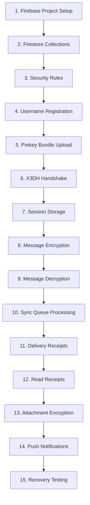

# Phase 4.3 Execution Order — Encrypted Transport Layer

This document details the exact, chronological sequence of implementation steps for building MemoVault's End-to-End Encrypted (E2EE) messaging transport layer. Strictly adhering to this sequence minimizes integration risk, protects cryptographic session integrity, and enforces production-grade coercion resistance boundaries.

---

## Chronological Implementation Sequence

### 1. Firebase Project Setup
*   **Actions**:
    *   Configure Firebase CLI and initialize dynamic environment configurations.
    *   Establish multi-environment support (Dev, Staging, Prod) fully aligned with our Flutter flavor definitions:
        *   Dev: `com.memovault.dev`
        *   Staging: `com.memovault.staging`
        *   Prod: `com.memovault`
    *   Verify that `GoogleService-Info.plist` and `google-services.json` are separated and dynamically loaded on build.

### 2. Firestore Collections
*   **Actions**:
    *   Initialize Cloud Firestore database inside the secure Firebase Console.
    *   Set up root-level document collections matching Phase 4 data models:
        *   `/pseudonyms`: Stores active pseudonyms and their bound public Identity Keys ($IK_{pub}$).
        *   `/prekey_bundles`: Stores active X3DH key prekeys for handshake initiation.
        *   `/sync_queues`: Stores ephemeral in-transit encrypted payloads.

### 3. Security Rules
*   **Actions**:
    *   Deploy the strict Firestore Security Rules defined in `ADR-021` and `Phase 4.3 Backend Security Review`.
    *   **Uniqueness & Integrity constraints**:
        *   Map usernames directly to document IDs inside `/pseudonyms` to atomically enforce uniqueness via write-lock transactions.
        *   Add `request.resource.data.keys().hasOnly([...])` schemas to strictly validate that clients cannot inject undocumented metadata or properties.
        *   Set `/sync_queues` to be read-and-delete only for the recipient, and write-only for the authenticated sender.

### 4. Username Registration
*   **Actions**:
    *   Build client-side Firestore connector logic during the `identityPublished` state.
    *   Attempt write to `/pseudonyms/{normalized_username}` containing E2E public keys using **Firestore Transactions (`runTransaction()`)** rather than simple `set()` queries to prevent any simultaneous registration race conditions.
    *   Handle registration responses:
        *   If successful, advance the onboarding controller to the `ready` state.
        *   If rejected with `already-exists` or `permission-denied` (due to Firestore document ID unique collision), capture the error, stop state progress, and prompt the user to choose another pseudonym.

### 5. Prekey Bundle Upload
*   **Actions**:
    *   Upon successful username registration, the client generates a full Extended Triple Diffie-Hellman (X3DH) Prekey Bundle:
        *   Identity Key: $IK_{pub}$
        *   Signed Prekey: $SPK_{pub}$ with signature $Sig(IK_{priv}, SPK_{pub})$
        *   One-Time Prekeys: $OPK1_{pub}, OPK2_{pub}, \dots$
    *   Upload the bundle to `/prekey_bundles/{username}` to populate the secure public E2EE directory.

### 6. X3DH Handshake
*   **Actions**:
    *   Implement client-side handshakes using the standard Curve25519 E2E key exchange protocol.
    *   When starting a chat, download the recipient's prekey bundle from `/prekey_bundles/{recipient_username}`.
    *   Verify the signed prekey's signature.
    *   Execute Diffie-Hellman operations on keys ($IK, SPK, OPK$) to derive the shared cryptographic root key ($K_{root}$) using HKDF.

### 7. Session Storage
*   **Actions**:
    *   Save session parameters securely inside the local SQLCipher database (`hidden_vault.db` or `memovault.db` depending on isolation state).
    *   **Phase 4.3B Scope**: Persist the static E2E shared root key ($K_{root}$) and derive static session encryption/decryption keys ($K_{session}$) using HKDF.
    *   **Phase 4.4 Upgrade**: Expand session storage to track full Double Ratchet parameters: Root key, Chain keys, dynamic transmission/reception counter indices, and skipped message keys enclaves.
    *   **DH Ratchet Rotations (Phase 4.4)**: Define and trigger DH Ratchet rotations whenever:
        *   A new cryptographic prekey session is established.
        *   An identity key changes.
        *   A session recovery event occurs.
    *   Ensure all session data is wiped from RAM immediately upon session lock.

### 8. Message Encryption
*   **Actions**:
    *   **Phase 4.3B Scope**: Encrypt plaintext messages using static session encryption keys ($K_{session}$) derived from $K_{root}$ via authenticated symmetric encryption (AES-256-GCM + SHA-256 HMAC validation).
    *   **Phase 4.4 Upgrade**: Upgrade encryption to encrypt payloads dynamically using the active Double Ratchet sender keys generated on each ratchet step.
    *   Construct the standard E2E transmission payload containing the ciphertext, nonce, and active ephemeral DH keys.

### 9. Message Decryption
*   **Actions**:
    *   Parse incoming payloads from `/sync_queues/{messageId}`.
    *   **Phase 4.3B Scope**: Decrypt the symmetric payload using the static session decryption keys ($K_{session}$) derived from $K_{root}$, verifying GCM integrity tags.
    *   **Phase 4.4 Upgrade**: Execute dynamic ratchet steps to derive the corresponding message decryption key, retrieving out-of-order skipped keys from the SQLCipher cache securely to handle late-arriving packets, and preventing replay attacks.
    *   Construct the standard reactive `MessageEntity`.

### 10. Sync Queue Processing
*   **Actions**:
    *   Establish the sync pipeline. The production target utilizes **FCM Push-Triggered Sync** (`FCM Wakeup ➔ Fetch `/sync_queues` ➔ Decrypt ➔ Atomically Delete from Firestore`) to save battery, reduce costs, and maintain zero-knowledge server state. A local polling sync queue is built *only* as a fallback/offline development simulation runner.
    *   Fetch in-transit payloads from `/sync_queues` where `recipient_username` is the active user.
    *   Write decrypted messages to the local database, and **immediately delete the retrieved document from Firestore** inside an atomic database transaction to guarantee queue ephemerality.

### 11. Delivery Receipts
*   **Actions**:
    *   Upon successful retrieval and local write of a sync payload, the recipient client uploads a lightweight E2E receipt payload to `/sync_queues` marked as a `'handshake'` or `'system'` message type representing a delivery acknowledgment.
    *   Once retrieved by the sender, the message state reactively transitions to `delivered` in the UI.

### 12. Read Receipts
*   **Actions**:
    *   When the user opens a private chat conversation screen, update all unread messages to `read` status locally.
    *   Transmit a secure read-acknowledgment handshake to the recipient to reactively update their conversation thread status ticks.

### 13. Attachment Encryption
*   **Actions**:
    *   For images, videos, files, or voice recordings:
        *   Generate a highly secure, ephemeral symmetric key (AES-GCM-256).
        *   Encrypt the raw media bytes on-device.
        *   Upload the encrypted ciphertext to Firebase Storage.
    *   Encrypt the symmetric decryption key + file storage URL within the standard E2EE text payload and transmit it over the standard chat transport channel.

### 14. Push Notifications
*   **Actions**:
    *   Integrate Firebase Cloud Messaging (FCM) to trigger background wakeups on the client device.
    *   Implement masked notification payloads: **never transmit sender pseudonyms, message content, or attachment details inside push notification channels**. Show only generic text like: *"New secure message received"*.
    *   Upon wakeup, trigger a background sync run to fetch and delete payloads directly from Firestore.

### 15. Recovery Testing
*   **Actions**:
    *   Validate the volatile identity restoration pathway.
    *   Wipe local identities using the Panic PIN.
    *   Input the 12-word recovery phrase on the Seed Recovery screen and verify that E2E sessions are successfully recovered, E2E public keys are fetched from `/pseudonyms`, and private messaging keys are safely re-derived under the "One Device Rule".
