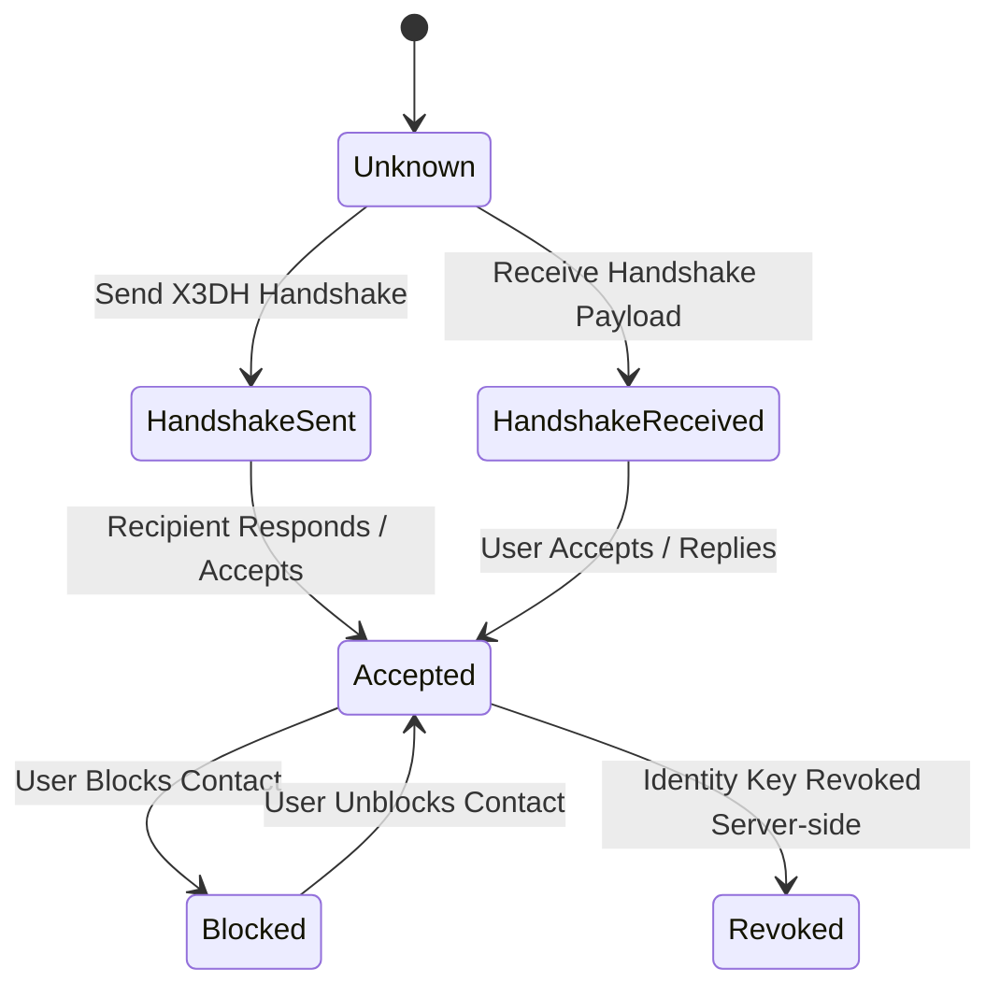

# ADR-022 — Conversation Model & Contact Lifecycle

**Status:** Accepted

**Date:** 2026-05-31

---

## Context

MemoVault is establishing its peer-to-peer end-to-end encrypted (E2EE) messaging protocol. Implementing security handshakes (Phase 4.3B) and message transport (Phase 4.3C) requires a formal, stable definition of:
1. **Contact Lifecycle States**: How users transition from discovery to established trust or blocking.
2. **Conversation Types**: Structural limitations on chat threads (e.g. 1-to-1 vs groups).
3. **Message States**: Status tracking for reliable, verified delivery.
4. **Identity Change Rules**: How the client responds when a user's identity keys change (seed recovery vs new key generation).
5. **Reverse Lookup Optimization**: Future optimization for identity-based username recovery.

Without a unified architectural agreement on these behaviors, the frontend controllers, local storage layers, and Firestore schemas will diverge, introducing race conditions, data inconsistencies, and security flaws.

---

## Decision

### 1. Contact Lifecycle States
To model cryptographic trust and user relationships, every contact stored in the local Drift database belongs to one of the following states:



- **Unknown**: The handle is discovered in the directory, but no cryptographic session or contact record has been initialized.
- **Handshake Sent**: The local user has built a session cipher bundle and sent an initial handshake message to the recipient's Firestore sync queue. No plaintext messages can be decrypted or read from this user yet.
- **Handshake Received**: A remote user has deposited an initial handshake prekey message in the local user's sync queue. The local client holds the session in a pending trust state.
- **Accepted**: A bidirectional cryptographic session is established and active. Standard encrypted messages are exchanged.
- **Blocked**: The local user has blocked the contact. The local client discards any incoming payloads from the blocked participant and hides the conversation thread from the main view.
- **Revoked**: The contact has published a signed key revocation. The client flags the handle as inactive and disables message sending.

### 2. Conversation Types
- **1-to-1 Only**: Phase 4 messaging is strictly limited to direct, single-peer chats between two participants. 
- Group chats, channels, or multi-device message fan-out are explicitly out of scope for Phase 4 to maintain simplicity and cryptographically isolated Double Ratchet sessions.

### 3. Message States
To support delivery guarantees and read receipts, the `MessageReceipts` table tracks the following lifecycle states for every message sent or received:

- **Pending**: The message is encrypted and saved locally in Drift, waiting to be sent to the network.
- **Sent**: The ciphertext payload has been successfully written to the recipient's Firestore `/sync_queues/{recipient_uid}`.
- **Delivered**: The recipient's device has fetched the sync queue document and sent back an encrypted delivery confirmation receipt.
- **Read**: The recipient has viewed the message bubble on screen, and a read receipt has been received and decrypted locally.
- **Failed**: The message could not be sent after retries, or the Double Ratchet session failed to encrypt/decrypt the payload.
- **Deleted**: The message is soft-deleted (the `isDeleted` column is marked `true`).

### 4. Identity Key Change Behavior
When a remote user undergoes onboarding or restoration, their public identity key dictates how the local client trusts them:

- **Case 1: Same Identity Key (Deterministic Recovery)**
  - If a user restores their identity using their original **12-word recovery seed**, the derived Curve25519 `identityPublicKey` remains identical.
  - The local client continues the existing conversation thread seamlessly with no warnings, as the cryptographic identity remains unchanged.
- **Case 2: Different Identity Key (New Key Generated)**
  - If a contact generates a new key pair (e.g. by registering a new identity on a different device under the same username handle, or losing their seed and setting up fresh), their public key changes.
  - **Security Warning Action**: The local client detects the mismatch between the stored public key and the new key fetched from the `/pseudonyms` collection. It immediately:
    1. Displays a prominent, non-dismissible safety warning inside the Chat screen:
       > **⚠️ Security Alert**: *[Display Name]'s security code has changed. This could mean they re-registered on a new device, or that a third-party is attempting to intercept your messages. Verify their identity fingerprint.*
    2. Blocks automated outgoing message transmissions to this contact.
    3. Forces the user to click a **"Trust New Identity"** button, which updates the local stored identity key to the new key, before resuming chat capabilities.

### 5. Identity Recovery Lookup Optimization (Reverse Lookup)
- **Current Lookup Strategy**: Local recovery of username handles via a mnemonic seed queries Firestore using:
  ```dart
  where('identityPublicKey', isEqualTo: pubKey)
  ```
  While acceptable for infrequent recovery operations, this query behaves as a collection scan on Firestore.
- **Future O(1) Lookup Optimization**: 
  We will introduce a secondary key-value collection `/identity_registry/{identityPublicKey}` where the document ID is the public key string and the content is the associated username handle.
  This allows O(1) direct document reads (`db.collection('identity_registry').doc(pubKey).get()`) for instant handle recoveries, avoiding search overheads and indexing costs as the user registry scales.

---

## Consequences

- **Secure Trust Bounds**: Clear warning banners prevent Man-in-the-Middle (MitM) attacks if a contact's keys are swapped.
- **Normalized Lifecycle Handling**: DAO and repository states can use a clean enum matching the message and contact lifecycles.
- **No Race Conditions**: Group chat complexity is entirely avoided, simplifying the Double Ratchet state management.
